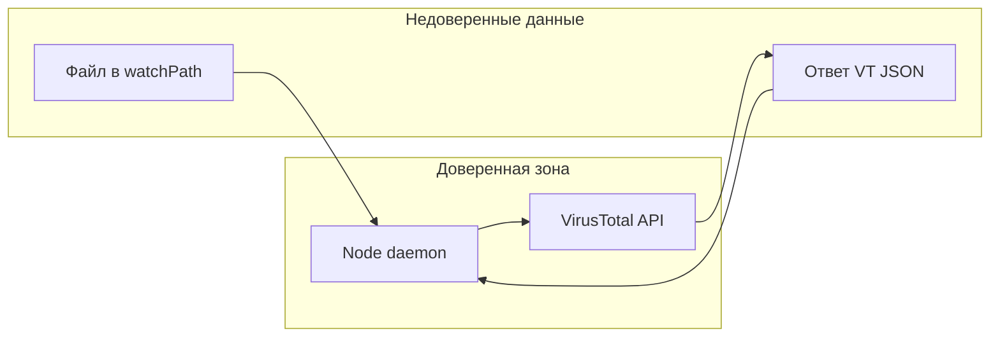

# Пробелы безопасности, которые проект не закрывает

Ниже — не «уязвимости в коде», а **системные ограничения модели**: что защита не обещает и где доверие/конфигурация остаются слабым местом.

---

## 1. Окно до и между этапами (гонки)

- **До `chmod 0o000`**: между появлением inode/имени в каталоге и срабатыванием [`fs.watch` + `fsChmod`](../src/watcher.ts) другой процесс с тем же пользователем теоретически может успеть открыть/запустить файл (особенно если не используется опциональный [ESWatcher](../es-daemon/Sources/ESWatcher/main.swift), который блокирует `AUTH_EXEC` по префиксу пути).
- **Между `chmod` и карантином**: несколько секунд [`awaitWriteFinish`](../src/watcher.ts) — файл уже «заблокирован» по правам, но ещё в исходной папке; это снижает риск запуска, но не устраняет полностью модель «доверяем только chmod» для процессов с правами обхода (см. п. 2).
- **Опциональный ES** требует root/entitlements и не входит в минимальный сценарий «только Node».

---

## 2. Тот же пользователь ОС (UID)

- Любой код от имени того же пользователя может **снова выставить права** на файл в watch-каталоге или читать `config.json` с ключом VT.
- Проект **не вводит** мандатный контроль (Seatbelt/App Sandbox для Node не используется; это прямо отмечено в [security-hardening.md](security-hardening.md)).

---

## 3. Один процесс = чтение образца + сеть

- Поток по умолчанию: [чтение всего файла в память и загрузка в VT](../src/virus-checker.ts) в том же процессе, что и парсинг конфигов/SQLite/UI.
- Это **не разделение** «ingest без сети / uploader с сетью», описанное в [security-hardening.md](security-hardening.md) как более сильный паттерн: компрометация Node или парсера даёт и доступ к байтам образца, и исходящий HTTPS.

---

## 4. Ограничения и риски VirusTotal

- **Ложные «чистые» и задержка сигнатур** — восстановление «clean» в watch-каталог ([`restoreToWatch`](../src/file-mover.ts)) доверяет вердикту/кэшу.
- **Ложные срабатывания** — неудобство и возможная потеря данных при агрессивном удалении из UI.
- **Конфиденциальность**: загрузка на VT раскрывает образец третьей стороне (политика VT).
- **Квоты и отказы API** → `inconclusive`; поведение «оставить в карантине» лучше, чем молчаливый пропуск, но **гарантии отсутствия вредоноса нет**.

---

## 5. Локальный HTTP API без аутентификации

Сервер в [`src/ui-server.ts`](../src/ui-server.ts): по умолчанию хост из [`HTTP_HOST` / `127.0.0.1`](../src/config.ts).

- **Нет auth**: любой, кто может достучаться до порта (например, при `HTTP_HOST=0.0.0.0` или пробросе порта), может:
  - читать **`GET /api/config`** (в т.ч. `vtApiKey`, пути);
  - **`POST /api/config`** — менять пути и секреты, писать [`config.json`](../src/config.ts);
  - **`DELETE /api/jobs`**, **`POST .../cancel`**, **`DELETE .../quarantine`** — вмешательство в учёт и файлы.
- Документация предупреждает про привязку к localhost/proxy с auth ([security-hardening.md](security-hardening.md)), но **средств принуждения в коде нет**.

---

## 6. DoS и ресурсы

- [`readFileSync`](../src/virus-checker.ts) загружает файл целиком — **огромный файл** → память/время.
- Массовый дроп файлов → рост SQLite, очередь задач, нагрузка на VT и диск (карантин).
- Отдельного **лимита размера/частоты** в коде на момент составления документа нет.

---

## 7. Наблюдение только за одним каталогом (не рекурсивно)

- [`fs.watch(..., { recursive: false })`](../src/watcher.ts) и chokidar на `watchPath` — типично **прямые дети** каталога; вложенные подпапки **не получают ту же модель** без смены дизайна (это функциональный и security-скоп: файлы «глубже» могут обходить ожидания).

---

## 8. Секреты и артефакты на диске

- `config.json` с ключом VT, SQLite с путями/историей — **читаемы процессами пользователя**; проект не шифрует и не изолирует их от остальной сессии.

---

## 9. Что проект явно не заявляет

- Защита от **фишинга, сетевых эксплойтов вне watch-каталога, компрометации учётки macOS, физического доступа**.
- **Целостность самого демона** (подмена бинаря/node_modules) — вне scope.
- **Linux/macOS контейнерные профили** — в compose есть намёки; полный egress-allowlist/seccomp — на стороне оператора ([security-hardening.md](security-hardening.md)).

---

### Итог одной фразой

Проект **снижает риск запуска непроверенных файлов из конкретной папки** за счёт быстрого lockdown прав, карантина и VT, но **не даёт изоляции на уровне ОС/процесса**, **не устраняет доверие к VT и локальному API**, и **не защищает от атакующего с тем же UID или от сетевого доступа к HTTP**, если тот ошибочно открыт наружу.
